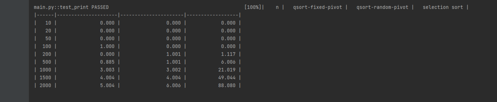

# CMPS 2200 Reciation 6
## Answers

**Name:**__Maria Chen / Haochen Chen_______________________

Place all written answers from `recitation-06.md` here for easier grading.

- **1a.**

For an array that has already been sorted, if you choose to use quick sort and use the first element as the reference, because the reference selected each time is the minimum value of the input array, the length of the subarray on the right in the generated subarray is the input array length n-1. Therefore, the time complexity and space complexity are both O(n^2). This causes a stack overflow when testing an array of size 5000, so the upper limit of the array size when comparing an already sorted input array is 2000.

- **1b.**

The first comparison is the sorted array, and the result is shown in the following figure.

The next comparison is the out-of-order array, and the result is shown in the following figure

Looking at the above figure, you can see that in a sorted array, the speed of using quicksort is slower than that of selection sort, because the list is copied every time it recurs.

In sorted arrays, qsort-random-pivot is the fastest

In an out-of-order array, qsort-fixed-pivot is the fastest

The times for selection sort and qsort-random-pivot are basically unchanged regardless of the array.

qsort-fixed-pivot is very different between the two arrays, because in the case of random arrays, the time complexity of quicksort is O(nlogn), while in the case of sorted arrays it degenerates to O(n ^2)

- **1c.**
  
In addition to the sort that comes with python, the fastest one is qsort-fixed-pivot. The main reason for such a large time gap is that the input parameters of qsort are limited and the list copy operation is required, and a large number of memory operations make the speed slower. 
